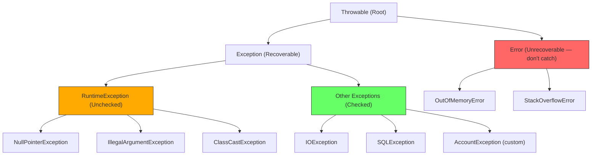

# Java Exception Handling — Interview Notes 🚀

## 1. What are Exceptions?
An **Exception** is an event that disrupts the normal flow of a program's execution. In Java, it is an **object** that encapsulates:
- A **descriptive message** (`getMessage()`)
- A **stack trace** (`printStackTrace()`) — the call chain leading to the error
- An optional **cause** (`getCause()`) — the wrapped original exception

---

## 2. Throwable Hierarchy



| Category | Root | Compiler enforces? | Use for |
| :--- | :--- | :--- | :--- |
| **Checked** | `Exception` | ✅ Yes — catch or declare | Recoverable conditions (IO, DB) |
| **Unchecked** | `RuntimeException` | ❌ No | Programming bugs |
| **Error** | `Error` | ❌ No | JVM-level — never catch |

---

## 3. Catching Exceptions

```java
try {
    int result = 10 / 0;               // throws ArithmeticException
} catch (ArithmeticException e) {
    System.out.println(e.getMessage()); // "/ by zero"
    System.out.println(e.getClass().getSimpleName()); // "ArithmeticException"
    e.printStackTrace();                // full stack trace to stderr
}
```

### Specific → General ordering
> [!IMPORTANT]
> Always catch more **specific** exceptions **before** more **general** ones. If a general catch block (`Exception`) comes first, specific blocks become unreachable — compiler error for checked exceptions.

```java
try { /* code */ }
catch (FileNotFoundException e) { /* more specific */ }
catch (IOException e)           { /* less specific */ }
catch (Exception e)             { /* general fallback */ }
```

---

## 4. Multi-catch (Java 7+)
When two exception types need **identical handling** — avoids code duplication.

```java
try {
    // code that may throw either
} catch (ArithmeticException | ArrayIndexOutOfBoundsException e) {
    System.out.println(e.getClass().getSimpleName() + ": " + e.getMessage());
}
// Note: 'e' is effectively final in a multi-catch block
```

---

## 5. `finally` Block
Runs **always** — whether an exception was thrown or not, and even after `return`.

```java
try {
    return "from-try";
} catch (Exception e) {
    // handle
} finally {
    System.out.println("always runs"); // runs BEFORE the return value is handed to caller
}
```

> [!WARNING]
> `finally` does **not** run if `System.exit()` is called or the JVM crashes. If `finally` itself throws an exception, the original exception is suppressed.

---

## 6. `try-with-resources` (Java 7+)
Automatically calls `close()` on any resource that implements `AutoCloseable` (or `Closeable`).

```java
// Single resource
try (BufferedReader br = new BufferedReader(new FileReader("file.txt"))) {
    System.out.println(br.readLine());
} catch (IOException e) {
    e.printStackTrace();
}
// br.close() called automatically — even if exception thrown

// Multiple resources — closed in REVERSE declaration order
try (var r1 = new FileInputStream("a.txt");
     var r2 = new FileInputStream("b.txt")) {
    // r2 closed first, then r1
} catch (IOException e) { /* handle */ }
```

> [!TIP]
> Prefer `try-with-resources` over `finally { resource.close() }` — eliminates boilerplate and correctly handles exceptions thrown from `close()`.

### Custom AutoCloseable
```java
class DbConnection implements AutoCloseable {
    DbConnection() { System.out.println("opened"); }
    public void query(String sql) { /* ... */ }
    @Override
    public void close() { System.out.println("closed"); }
}

try (var db = new DbConnection()) {
    db.query("SELECT 1");
} // → "closed" printed automatically
```

---

## 7. `throw` keyword — explicitly raise exceptions

```java
// Unchecked: illegal arguments (RuntimeException — no need to declare)
public void deposit(float amount) {
    if (amount <= 0)
        throw new IllegalArgumentException("Amount must be positive, got: " + amount);
}

// Checked: business rule violation (must declare with throws or catch)
public void withdraw(float value) throws AccountException {
    if (value > balance)
        throw new AccountException(new InsufficientFundsException());
}
```

---

## 8. `throws` clause — declare checked exceptions
Propagates checked exceptions to the caller without handling them locally.

```java
public void readFile(String path) throws IOException {
    // Compiler is satisfied — caller must handle IOException
    new FileReader(path);
}

// Caller must handle:
try {
    readFile("data.txt");
} catch (IOException e) {
    System.err.println("File error: " + e.getMessage());
}
```

---

## 9. Custom Exceptions

### Checked (extends `Exception`)
```java
// Base domain exception — wraps a cause
public class AccountException extends Exception {
    public AccountException(Exception cause) {
        super(cause); // cause accessible via getCause()
    }
    public AccountException(String message) {
        super(message);
    }
    public AccountException(String message, Exception cause) {
        super(message, cause);
    }
}

// Specific condition
public class InsufficientFundsException extends Exception {
    public InsufficientFundsException() {
        super("Insufficient funds in your account.");
    }
    public InsufficientFundsException(String message) {
        super(message);
    }
}
```

### Unchecked (extends `RuntimeException`) — more common in modern APIs
```java
public class UserNotFoundException extends RuntimeException {
    public UserNotFoundException(int id) {
        super("User not found: id=" + id);
    }
}
```

> [!TIP]
> Extend `RuntimeException` (unchecked) for exceptions that callers **cannot reasonably recover from**. Extend `Exception` (checked) when callers **should be forced to handle** the condition.

---

## 10. Exception Chaining (Wrapping)
Wraps a low-level exception inside a domain exception to hide implementation details while preserving the cause chain.

```java
private void loadUserFromDb(int id) throws AccountException {
    try {
        // low-level operation
        throw new SQLException("Connection refused");
    } catch (SQLException e) {
        // wrap: domain exception, original cause preserved
        throw new AccountException(e);
    }
}

// Caller can inspect the cause chain:
try {
    loadUserFromDb(42);
} catch (AccountException e) {
    System.out.println("Domain: " + e.getMessage());
    Throwable cause = e.getCause();
    while (cause != null) {
        System.out.println("  caused by: " + cause.getMessage());
        cause = cause.getCause();
    }
}
```

---

## 11. Re-throwing

```java
// a) Re-throw the same exception (catch, log, rethrow)
try {
    account.withdraw(999);
} catch (AccountException e) {
    logger.error("withdraw failed", e); // log with cause
    throw e;                            // rethrow — never swallow!
}

// b) Wrap and rethrow (checked → unchecked)
try {
    account.withdraw(500);
} catch (AccountException e) {
    throw new RuntimeException("Account operation failed", e); // no need to declare
}
```

> [!IMPORTANT]
> **Never swallow exceptions silently:**
> ```java
> catch (Exception e) { }  // ← BAD: hides errors, makes debugging impossible
> ```

---

## 12. Nested try-catch

```java
try {
    System.out.println("Outer: start");

    try {
        int[] arr = new int[3];
        arr[10] = 99; // inner exception — handled here
    } catch (ArrayIndexOutOfBoundsException e) {
        System.out.println("Inner: array error handled");
        // outer try continues normally
    }

    System.out.println("Outer: continues");
    int x = 10 / 0; // propagates to outer catch

} catch (ArithmeticException e) {
    System.out.println("Outer: arithmetic error");
} finally {
    System.out.println("Outer: finally");
}
```

---

## 13. Common Runtime Exceptions

| Exception | Trigger | Prevention |
| :--- | :--- | :--- |
| `NullPointerException` | Calling method on `null` | Null checks, `Optional`, `@NotNull` |
| `ArrayIndexOutOfBoundsException` | Accessing `arr[i]` where `i ≥ length` | Check `i < arr.length` |
| `ClassCastException` | `(Integer) "hello"` | Use `instanceof` before cast |
| `NumberFormatException` | `Integer.parseInt("abc")` | Try-catch or regex validate |
| `ArithmeticException` | `x / 0` (integer division) | Check divisor != 0 |
| `IllegalArgumentException` | Bad method argument | Validate input at method entry |
| `IllegalStateException` | Object in wrong state | State checks, builder patterns |
| `ConcurrentModificationException` | Modify collection during for-each | Use `Iterator.remove()` |
| `StackOverflowError` | Infinite recursion | Add base case |

```java
// Safe cast pattern
Object obj = getSomething();
if (obj instanceof String s) {    // Java 16 pattern matching
    System.out.println(s.length());
}

// Safe parse
try {
    int n = Integer.parseInt(input);
} catch (NumberFormatException e) {
    System.out.println("Invalid number: " + input);
}
```

---

## 14. Best Practices Checklist

| Practice | Rule |
| :--- | :--- |
| ✅ Catch specific exceptions | Never catch `Exception` / `Throwable` unless truly necessary |
| ✅ Never swallow exceptions | Empty `catch {}` block is always wrong |
| ✅ Prefer `try-with-resources` | Over manual `finally { resource.close() }` |
| ✅ Use meaningful messages | Include context: values, IDs, state |
| ✅ Wrap, don't expose | Wrap low-level exceptions in domain exceptions |
| ✅ Log OR throw, not both | Logging + rethrowing causes duplicate log entries |
| ✅ Document with `@throws`| Javadoc all checked exceptions |
| ✅ Unchecked for bugs | `RuntimeException` for programming errors that can't be recovered |
| ✅ Checked for recoverable | `Exception` when caller is expected to handle meaningfully |

---

## 15. Summary Table

| Keyword | Where | Purpose |
| :--- | :--- | :--- |
| `try` | Encloses risky code | Monitors for exceptions |
| `catch(ExType e)` | After `try` | Handles a specific exception type |
| `finally` | After `catch` | Always-run cleanup block |
| `throw` | Inside a method | Explicitly raises an exception object |
| `throws` | Method signature | Declares checked exceptions the method may raise |
| `try (res)` | Java 7+ | Opens resources; auto-closes on exit |

> [!IMPORTANT]
> **Key Interview Rules**:
> 1. `throw` raises an exception; `throws` **declares** that a method may raise one.
> 2. `finally` always runs — but `System.exit()` skips it.
> 3. `try-with-resources` closes in **reverse** declaration order.
> 4. `getCause()` retrieves the wrapped exception in a chained exception.
> 5. Never catch `Error` (e.g., `OutOfMemoryError`) — you can't recover.
> 6. Multi-catch variable `e` is **effectively final** — you cannot reassign it.
> 7. A checked exception inside a lambda must be caught inside the lambda or the FI must declare `throws`.
