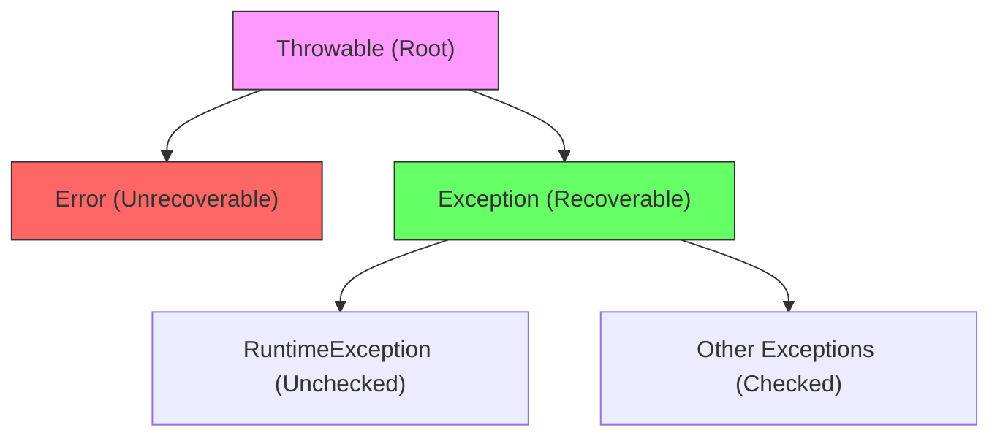

# Java Exception Handling - Interview Notes 🚀

## 1. What are Exceptions?
An **Exception** is an event that occurs during the execution of a program that disrupts the normal flow of instructions. 
- In Java, an exception is an **object** that encapsulates the error event.
- It contains a **stack trace** (the sequence of methods called leading to the error) and a descriptive message.

---

## 2. Types of Exceptions
Java categorizes throwables into three main buckets:

### A. Checked Exceptions
*   **Definition**: Checked at compile-time. The compiler forces the programmer to handle them.
*   **Use Case**: Conditions that a well-written application should anticipate and recover from.
*   **Examples**: `IOException`, `SQLException`, `ClassNotFoundException`.

### B. Unchecked Exceptions (Runtime Exceptions)
*   **Definition**: Not checked at compile-time. They occur due to programming errors (logic bugs).
*   **Use Case**: Indicates improper use of an API or logical flaws.
*   **Examples**: `NullPointerException`, `ArrayIndexOutOfBoundsException`, `ArithmeticException`.

### C. Errors
*   **Definition**: Serious problems that an application should not try to catch. Usually relate to the JVM or environment.
*   **Examples**: `OutOfMemoryError`, `StackOverflowError`, `VirtualMachineError`.

---

## 3. Exceptions Hierarchy
All exception and error types are subclasses of the `Throwable` class.



---

## 4. Catching Exceptions
The `try-catch` block is the primary mechanism for handling exceptions.
```java
try {
    // Dangerous code
    int data = 50 / 0; 
} catch (ArithmeticException e) {
    // Handling logic
    System.out.println("Mathematical error: " + e.getMessage());
}
```

---

## 5. Catching Multiple Type of Exceptions
You can handle multiple exceptions for a single `try` block.

### Multiple Catch Blocks (Specific to General)
```java
try {
    // code
} catch (ArithmeticException e) {
    // specific
} catch (Exception e) {
    // general
}
```
> [!IMPORTANT]
> Always catch more specific exceptions before more general ones (e.g., `ArithmeticException` before `Exception`). Otherwise, the specific catch block will be unreachable.

### Multi-catch Block (Java 7+)
Reduces code duplication when different exceptions require the same handling.
```java
try {
    // code
} catch (ArithmeticException | NullPointerException e) {
    System.out.println("Error: " + e.getMessage());
}
```

---

## 6. The finally Block
The `finally` block executes **regardless** of whether an exception was thrown or caught.
*   Use it for cleanup logic (closing files, sockets, etc.).
*   **Caveat**: It won't run if the JVM crashes or `System.exit()` is called.

---

## 7. The try-with-resources Statement (Java 7+)
Automates cleanup of resources that implement `AutoCloseable`.
```java
try (BufferedReader br = new BufferedReader(new FileReader("test.txt"))) {
    System.out.println(br.readLine());
} catch (IOException e) {
    e.printStackTrace();
}
// Resource is closed automatically, no finally block needed!
```

---

## 8. Throwing Exceptions
*   **throw**: Used inside a method to explicitly throw an exception object.
*   **throws**: Used in a method signature to declare that the method might throw exceptions.

```java
public void validate(int age) throws InvalidAgeException {
    if (age < 18) {
        throw new InvalidAgeException("Not eligible to vote");
    }
}
```

---

## 9. Re-throwing Exceptions
Useful when you want to catch an exception, perform a local action (like logging), and then pass it up to the caller.
```java
try {
    processFile();
} catch (IOException e) {
    log.error("File processing failed", e);
    throw e; // Re-throwing
}
```

---

## 10. Custom Exceptions
Create domain-specific exceptions by extending `Exception` or `RuntimeException`.
```java
public class UserNotFoundException extends RuntimeException {
    public UserNotFoundException(String message) {
        super(message);
    }
}
```

---

## 11. Chaining Exceptions (Exception Wrapping)
Allows you to wrap one exception inside another to maintain the "causal chain."
```java
try {
    dbConnection.open();
} catch (SQLException e) {
    throw new ServiceException("Data layer error", e); // 'e' is the cause
}
```

---

## 12. Best Practices (Interview Checklist)
- ✅ **Catch Specific Exceptions**: Don't just catch `Exception`.
- ✅ **Never Swallow Exceptions**: Avoid empty `catch` blocks.
- ✅ **Log and Throw**: Don't do both unless necessary (can lead to duplicate logs).
- ✅ **Use Meaningful Messages**: Give context for troubleshooting.
- ✅ **Prefer Try-with-Resources**: Much cleaner than `finally` for IO.
- ✅ **Clean up**: Always release system resources.

---

## Summary
| Feature | Description |
| :--- | :--- |
| **Try** | Block of code to monitor for exceptions. |
| **Catch** | Block of code to handle a specific exception. |
| **Finally** | Block of code that always executes for cleanup. |
| **Throw** | Keyword used to manually throw an exception. |
| **Throws** | Clause used to declare exceptions in a method signature. |
