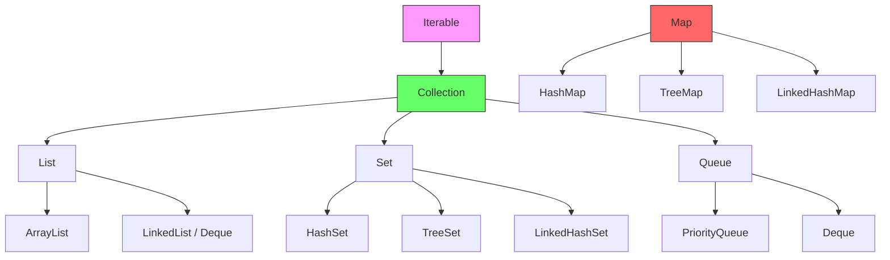

# Java Collections Framework (JCF) - Interview Notes 📚

## 1. Introduction
The **Java Collections Framework (JCF)** is a set of classes and interfaces that implement commonly reusable collection data structures. It provides a standardized way to store, manipulate, and manage groups of objects.

- **Primary Benefits**: Reduced programming effort, increased performance, and interoperability between unrelated APIs.

---

## 2. Overview of Collections Framework
The framework is divided into two main hierarchies:
1.  **Collection Hierarchy**: For groups of individual objects (`List`, `Set`, `Queue`).
2.  **Map Hierarchy**: For key-value pairs (`Map`).



---

## 3. The Need for Iterables
The `Iterable<T>` interface is the root of the collection hierarchy (though `Map` does not implement it).
- **Purpose**: It allows an object to be the target of the **"for-each loop"** statement.
- **Method**: It defines a single method: `Iterator<T> iterator()`.

```java
List<String> names = Arrays.asList("Alice", "Bob");
for (String name : names) { // Only possible because List implements Iterable
    System.out.println(name);
}
```

---

## 4. The Iterator Interface
An `Iterator` allows you to traverse a collection and safely remove elements during iteration (which a `for-each` loop cannot do without throwing `ConcurrentModificationException`).
- **Methods**: `hasNext()`, `next()`, and `remove()`.
- **ListIterator**: A specialized iterator for `List` that allows bidirectional traversal (`previous()`).

```java
List<Integer> numbers = new ArrayList<>(Arrays.asList(1, 2, 3, 4));
Iterator<Integer> it = numbers.iterator();
while (it.hasNext()) {
    if (it.next() % 2 == 0) {
        it.remove(); // Safely remove element during traversal
    }
}
// numbers is now [1, 3]
```

---

## 5. The Collection Interface
The root interface of the hierarchy (`java.util.Collection`). It defines core operations like:
- `add(E e)`, `remove(Object o)`
- `size()`, `isEmpty()`
- `contains(Object o)`
- `clear()`, `toArray()`

---

## 6. The List Interface
A **List** is an ordered collection that allows duplicate elements.

### A. ArrayList (The Go-to List)
- **Structure**: Dynamic Array.
- **Performance**: 
    - Random Access: **O(1)**
    - Adding (end): **O(1)** amortized.
    - Adding/Removing (middle): **O(n)** due to shifting.
- **Use Case**: When you need frequent read access.

### B. LinkedList
- **Structure**: Doubly Linked List.
- **Performance**: 
    - Random Access: **O(n)**
    - Adding/Removing (ends): **O(1)**
- **Use Case**: Frequently adding/removing elements from the beginning or end.

```java
// ArrayList Example
List<String> arrayList = new ArrayList<>();
arrayList.add("Java");
System.out.println(arrayList.get(0)); // Fast access O(1)

// LinkedList Example
LinkedList<String> linkedList = new LinkedList<>();
linkedList.addFirst("First"); // Fast insertion at start O(1)
linkedList.addLast("Last");
```

---

## 7. The Comparable Interface
Used for **Natural Ordering** of objects.
- **Method**: `int compareTo(T o)`
- **Rule**: If `this` < `o`, return negative; if `this` > `o`, return positive; else 0.
- **Usage**: Typically implemented by the class itself (e.g., `String`, `Integer`).

```java
class User implements Comparable<User> {
    int age;
    public User(int age) { this.age = age; }
    
    @Override
    public int compareTo(User other) {
        return Integer.compare(this.age, other.age); // ascending order
    }
}
```

---

## 8. The Comparator Interface
Used for **Custom Ordering**.
- **Method**: `int compare(T o1, T o2)`
- **Benefit**: You can define multiple sorting strategies without modifying the original class.
- **Usage**: `Collections.sort(list, new MyComparator())`.

```java
List<String> words = Arrays.asList("apple", "banana", "kiwi");

// Using Comparator via Lambda to sort by length instead of alphabetical order
words.sort((s1, s2) -> Integer.compare(s1.length(), s2.length()));
// Or better: words.sort(Comparator.comparingInt(String::length));
```

---

## 9. The Queue Interface
Designed for holding elements prior to processing.

- **PriorityQueue**: Elements are ordered according to their natural ordering or a `Comparator`. (Implemented as a Min-Heap).
- **Deque (Double Ended Queue)**: Supports element insertion and removal at both ends. `ArrayDeque` is usually faster than `Stack` and `LinkedList`.

```java
Queue<String> pq = new PriorityQueue<>();
pq.offer("C");
pq.offer("A");
pq.offer("B");
System.out.println(pq.poll()); // Prints "A" (natural ordering)

Deque<Integer> stack = new ArrayDeque<>();
stack.push(1); // ArrayDeque used as a Stack
stack.push(2);
System.out.println(stack.pop()); // Prints "2"
```

---

## 10. The Set Interface
A collection that contains **no duplicate elements**.

- **HashSet**: Backed by a `HashMap`. Unordered and allows one null element.
- **LinkedHashSet**: Maintains insertion order using a doubly-linked list.
- **TreeSet**: Maintains elements in sorted order (using a Red-Black Tree). **O(log n)** for basic operations.

```java
Set<String> hashSet = new HashSet<>();
hashSet.add("Apple");
hashSet.add("Apple"); // Ignored

Set<Integer> treeSet = new TreeSet<>(Arrays.asList(5, 1, 10));
System.out.println(treeSet); // Prints [1, 5, 10] (Sorted)
```

---

## 11. Hash Tables (Deep Dive)
In interviews, you'll likely be asked **how a HashMap works**.

### How Hashing Works:
1.  **Buckets**: A HashMap contains an array of buckets.
2.  **hashCode()**: When you `put(K, V)`, Java calculates the `hashCode()` of the key to determine the bucket index.
3.  **equals()**: If multiple keys land in the same bucket (**Collision**), Java uses `equals()` to find the correct entry.
4.  **Java 8+ Optimization**: If a bucket exceeds a threshold (8 elements), the linked list is converted into a **Balanced Tree** (O(log n) vs O(n)).

---

## 12. The Map Interfaces
Maps store data in **Key-Value** pairs. Keys must be unique.

| Implementation | Ordering | Performance |
| :--- | :--- | :--- |
| **HashMap** | Unordered | **O(1)** average |
| **LinkedHashMap** | Insertion Order | **O(1)** average |
| **TreeMap** | Sorted Order | **O(log n)** |
| **Hashtable** | Unordered | Synchronized (Slow/Legacy) |

```java
Map<String, Integer> map = new HashMap<>();
map.put("Alice", 25);
map.put("Bob", 30);

// Using putIfAbsent and getOrDefault
map.putIfAbsent("Charlie", 28);
System.out.println(map.getOrDefault("Dave", 0)); // Prints 0

// Iterating over a Map
for (Map.Entry<String, Integer> entry : map.entrySet()) {
    System.out.println(entry.getKey() + " -> " + entry.getValue());
}
```

> [!TIP]
> Always use `HashMap` for general use. Use `ConcurrentHashMap` if thread-safety is required in a multi-threaded environment.

---

## 13. Summary
| Data Structure | Ordered? | Duplicates? | Nulls? | Top Pick |
| :--- | :--- | :--- | :--- | :--- |
| **List** | Yes | Yes | Yes | `ArrayList` |
| **Set** | No | No | One | `HashSet` |
| **Queue** | FIFO/Priority | Yes | No | `ArrayDeque` |
| **Map** | No | No (Keys) | One (Key) | `HashMap` |
