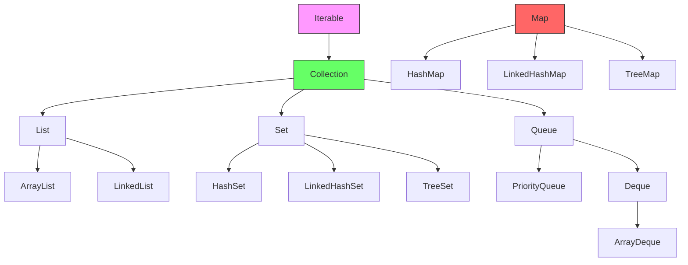

# Java Collections Framework (JCF) — Interview Notes 📚

## 1. Introduction
The **Java Collections Framework (JCF)** is a set of classes and interfaces implementing commonly reusable data structures. It provides a standardized way to store, manipulate, and manage groups of objects.

- **Primary Benefits**: Reduced programming effort, increased performance, and interoperability between unrelated APIs.

---

## 2. Framework Hierarchy



---

## 3. The `Iterable` Interface
Root of the collection hierarchy. Defines `Iterator<T> iterator()` which enables the **for-each loop**.

```java
List<String> names = List.of("Alice", "Bob");
for (String name : names) { System.out.println(name); } // only because List implements Iterable
```

---

## 4. The `Iterator` Interface
Allows safe **removal** during traversal (for-each throws `ConcurrentModificationException` if you remove).

| Method | Description |
| :--- | :--- |
| `hasNext()` | Returns true if more elements exist |
| `next()` | Returns next element |
| `remove()` | Removes last element returned by `next()` |

```java
List<Integer> numbers = new ArrayList<>(Arrays.asList(1, 2, 3, 4));
Iterator<Integer> it = numbers.iterator();
while (it.hasNext()) {
    if (it.next() % 2 == 0) it.remove(); // safe
}
// numbers = [1, 3]
```

**`ListIterator`** — bidirectional; also supports `set()` and `add()`.

```java
ListIterator<String> lit = items.listIterator();
while (lit.hasNext()) lit.set(lit.next().toUpperCase()); // replace during traversal
while (lit.hasPrevious()) System.out.print(lit.previous()); // reverse traversal
```

---

## 5. The Collection Interface
Root of the non-Map hierarchy. Core operations:

```java
collection.add(e);        collection.remove(o);
collection.contains(o);   collection.size();
collection.isEmpty();     collection.clear();
collection.toArray();
Collections.addAll(collection, "a", "b", "c"); // bulk add
```

---

## 6. List — Ordered, Duplicates Allowed

### A. ArrayList (Go-to List)
- **Structure**: Dynamic resizable array.
- **Performance**: O(1) random access, O(1) amortized add-at-end, O(n) insert/delete in middle.

```java
List<String> list = new ArrayList<>();
list.add("A");              // append
list.add(0, "!");           // insert at index — O(n)
list.get(0);                // O(1)
list.set(0, "Z");           // O(1)
list.remove(0);             // O(n) — shifts
list.remove("A");           // O(n) — scans + shifts
list.indexOf("A");          // first occurrence
list.lastIndexOf("A");      // last occurrence
list.subList(1, 4);         // view [1, 4) — backed by original
list.contains("B");
list.size(); list.isEmpty(); list.clear();
```

### B. LinkedList (Doubly-linked)
- **Performance**: O(1) add/remove at both ends, O(n) random access.
- Also implements **Deque** → usable as Stack or Queue.

```java
LinkedList<String> ll = new LinkedList<>();
ll.addFirst("A");  ll.addLast("D");  // O(1)
ll.removeFirst();  ll.removeLast();  // O(1)
ll.peekFirst();    ll.peekLast();    // O(1), no remove

// As Stack (LIFO)
Deque<Integer> stack = new ArrayDeque<>();
stack.push(1); stack.push(2);
stack.pop(); // 2

// As Queue (FIFO)
Deque<Integer> queue = new ArrayDeque<>();
queue.offer(1); queue.offer(2);
queue.poll(); // 1
```

> [!TIP]
> Prefer **`ArrayDeque`** over `Stack` (legacy, synchronized) and over `LinkedList` for Queue/Stack use — no node allocation overhead.

---

## 7. List Utilities (Collections class)

```java
Collections.sort(list);                         // natural order
Collections.sort(list, comparator);             // custom order
list.sort(Comparator.comparing(String::length)); // same, on list
Collections.reverse(list);
Collections.shuffle(list);
Collections.min(list); Collections.max(list);
Collections.frequency(list, element);
Collections.disjoint(list1, list2);             // true if no common element
Collections.nCopies(4, "Java");                 // [Java, Java, Java, Java]
Collections.unmodifiableList(list);             // read-only wrapper
Collections.binarySearch(sortedList, key);      // list must be sorted!
```

---

## 8. Comparable vs Comparator

### `Comparable<T>` — Natural Ordering (inside the class)
```java
class Customer implements Comparable<Customer> {
    private String name;
    @Override
    public int compareTo(Customer other) {
        return this.name.compareTo(other.name); // sort by name
    }
}
Collections.sort(customers); // uses compareTo()
```

### `Comparator<T>` — Custom Ordering (outside the class)
```java
// Named class
class EmailComparator implements Comparator<Customer> {
    public int compare(Customer a, Customer b) {
        return a.getEmail().compareTo(b.getEmail());
    }
}

// Lambda
customers.sort((a, b) -> a.getEmail().compareTo(b.getEmail()));

// Method reference (preferred)
customers.sort(Comparator.comparing(Customer::getEmail));

// Multi-key: length then alphabetically
words.sort(Comparator.comparingInt(String::length)
                     .thenComparing(Comparator.naturalOrder()));

// Reversed
customers.sort(Comparator.comparing(Customer::getEmail).reversed());
```

---

## 9. Immutable Lists (Java 9+)

| Factory | Behaviour |
| :--- | :--- |
| `List.of(...)` | Immutable, no nulls, no add/remove/set |
| `List.copyOf(col)` | Immutable snapshot; changes to original don't propagate |
| `Arrays.asList(...)` | Fixed-size but mutable (`set()` allowed, `add/remove` throws) |
| `Collections.unmodifiableList(list)` | Wrapper; still reflects changes in underlying list |

```java
List<String> fixed    = List.of("A", "B", "C");    // immutable
List<String> copy     = List.copyOf(mutableList);   // immutable snapshot
List<String> wrapper  = Collections.unmodifiableList(mutableList); // live read-only view
```

---

## 10. Queue — FIFO / Priority Processing

### Safe (non-throwing) vs Throwing methods

| Operation | Throws Exception | Returns null/false |
| :--- | :---: | :---: |
| Insert | `add(e)` | `offer(e)` |
| Remove head | `remove()` | `poll()` |
| Inspect head | `element()` | `peek()` |

> [!IMPORTANT]
> Prefer `offer/poll/peek` — they return `false`/`null` instead of throwing exceptions on empty/full queues.

### ArrayDeque as Queue (FIFO)
```java
Queue<String> queue = new ArrayDeque<>();
queue.offer("Task-1"); queue.offer("Task-2");
while (!queue.isEmpty()) System.out.println(queue.poll()); // Task-1, Task-2
```

### ArrayDeque as Stack (LIFO)
```java
Deque<Integer> stack = new ArrayDeque<>();
stack.push(1); stack.push(2); stack.push(3);
stack.pop();   // 3 (LIFO)
stack.peek();  // 2
```

### Deque — double-ended operations
```java
Deque<String> deque = new ArrayDeque<>();
deque.offerFirst("B"); deque.offerFirst("A"); // head: A B
deque.offerLast("C");  deque.offerLast("D");  // tail: C D → [A B C D]
deque.pollFirst();  // A
deque.pollLast();   // D
```

---

## 11. PriorityQueue — Heap-based

```java
// Min-Heap (default — smallest element first)
PriorityQueue<Integer> minHeap = new PriorityQueue<>();
minHeap.offer(5); minHeap.offer(1); minHeap.offer(3);
minHeap.poll(); // 1

// Max-Heap
PriorityQueue<Integer> maxHeap = new PriorityQueue<>(Comparator.reverseOrder());
maxHeap.poll(); // largest first

// Custom object ordering
PriorityQueue<Customer> pq = new PriorityQueue<>(); // uses Comparable (by name)
PriorityQueue<Customer> pqEmail = new PriorityQueue<>(new EmailComparator()); // by email
```

**Time complexity**: `offer()` O(log n), `poll()` O(log n), `peek()` O(1).

**Interview patterns**:
- Kth smallest → Min-Heap, drain k times.
- Kth largest → Min-Heap of size k (evict when `size > k`).
- BFS → use a plain `Queue` (ArrayDeque).
- Sliding window max → use a `Deque` (monotonic deque).

---

## 12. Set — No Duplicates

| Implementation | Order | Performance | Nulls |
| :--- | :--- | :--- | :--- |
| **HashSet** | None | O(1) avg | One null |
| **LinkedHashSet** | Insertion | O(1) avg | One null |
| **TreeSet** | Sorted | O(log n) | No null |

```java
Set<String> hashSet = new HashSet<>();
hashSet.add("A"); hashSet.add("A"); // second add returns false — ignored
hashSet.contains("A"); // O(1)

Set<String> linked = new LinkedHashSet<>(); // predictable iteration order

TreeSet<Integer> tree = new TreeSet<>(List.of(5, 1, 3, 2, 4));
// [1, 2, 3, 4, 5] — always sorted

// NavigableSet ops on TreeSet
tree.first(); tree.last();
tree.floor(3);    // largest ≤ 3
tree.ceiling(3);  // smallest ≥ 3
tree.headSet(4);  // elements < 4
tree.tailSet(3);  // elements ≥ 3
tree.subSet(2, 5); // 2 ≤ x < 5
tree.descendingSet();
tree.pollFirst();  tree.pollLast(); // remove and return
```

---

## 13. Set Math Operations

```java
Set<Integer> a = new HashSet<>(Set.of(1, 2, 3, 4, 5));
Set<Integer> b = new HashSet<>(Set.of(4, 5, 6, 7, 8));

// Union
Set<Integer> union = new HashSet<>(a); union.addAll(b);           // [1..8]

// Intersection — elements in both
Set<Integer> inter = new HashSet<>(a); inter.retainAll(b);        // [4, 5]

// Difference — in A but not B
Set<Integer> diff = new HashSet<>(a);  diff.removeAll(b);         // [1, 2, 3]

// Symmetric difference — in either but not both
Set<Integer> sym = new HashSet<>(union); sym.removeAll(inter);    // [1,2,3,6,7,8]

// Subset check
new HashSet<>(a).containsAll(Set.of(1, 2)); // true

// Disjoint check
Collections.disjoint(a, Set.of(10, 11)); // true — no common elements
```

---

## 14. Map — Key-Value Pairs

| Implementation | Order | Performance |
| :--- | :--- | :--- |
| **HashMap** | None | O(1) avg |
| **LinkedHashMap** | Insertion | O(1) avg |
| **TreeMap** | Sorted Key | O(log n) |
| **Hashtable** | None | Synchronized (legacy) |

### HashMap CRUD
```java
Map<String, Customer> map = new HashMap<>();
map.put("alice@mail.com", alice);         // insert / overwrite
map.get("alice@mail.com");               // null if absent
map.containsKey("key");
map.containsValue(alice);
map.remove("key");
map.remove("key", expectedValue);        // conditional remove
map.replace("key", newValue);
map.size(); map.isEmpty(); map.clear();
```

### Iteration (prefer `entrySet` — single pass)
```java
map.keySet().forEach(System.out::println);
map.values().forEach(System.out::println);
map.forEach((k, v) -> System.out.println(k + " → " + v)); // best
for (Map.Entry<String, Integer> e : map.entrySet())
    System.out.println(e.getKey() + ": " + e.getValue());
```

### Conditional Operations
```java
map.getOrDefault("missing", defaultVal);  // safe read
map.putIfAbsent("key", val);             // insert only if absent
map.replaceAll((k, v) -> transform(k, v));
```

### `merge()` — atomic upsert
```java
// if key absent → insert value; if present → apply BiFunction
wordCount.merge(word, 1, Integer::sum); // word-count in one line
grouped.merge(key, val, (existing, v) -> existing + "," + v); // build CSV
```

### `compute()` variants
```java
map.computeIfAbsent("key",  k -> new ArrayList<>()).add(item); // lazy init
map.computeIfPresent("key", (k, v) -> v + 1);                 // update if present
map.compute("key",          (k, v) -> v == null ? 1 : v + 1); // always invoked
```

### LinkedHashMap — LRU Cache pattern
```java
Map<Integer, String> lru = new LinkedHashMap<>(16, 0.75f, true) {
    protected boolean removeEldestEntry(Map.Entry<?, ?> e) { return size() > capacity; }
};
```

### TreeMap — NavigableMap
```java
TreeMap<String, Integer> tm = new TreeMap<>();
tm.firstKey(); tm.lastKey();
tm.floorKey("b");    // largest key ≤ "b"
tm.ceilingKey("b");  // smallest key ≥ "b"
tm.headMap("c");     // keys strictly < "c"
tm.tailMap("b");     // keys ≥ "b"
tm.subMap("a", "d"); // keys in ["a", "d")
tm.descendingMap();
```

### Immutable Maps (Java 9+)
```java
Map<String, Integer> fixed = Map.of("a", 1, "b", 2);  // up to 10 pairs
Map<String, Integer> large = Map.ofEntries(Map.entry("c", 3), Map.entry("d", 4));
Map<String, Integer> copy  = Map.copyOf(mutableMap);
```

---

## 15. Hash Tables — How HashMap Works
1. **Buckets**: An array of buckets indexed by hash.
2. **`hashCode()`**: Determines the bucket index.
3. **`equals()`**: Resolves collisions within the same bucket.
4. **Java 8+ optimization**: A bucket with > 8 entries converts from a linked list to a **balanced tree** (O(log n) worst-case instead of O(n)).
5. **Load factor 0.75**: When 75% full, the map rehashes (doubles capacity).

> [!IMPORTANT]
> If you override `equals()` in a class, you **must** also override `hashCode()`. Objects that are equal must have the same hash code — otherwise `HashSet` / `HashMap` will store duplicates.

---

## 16. Interview Patterns

### Frequency Counter (word count)
```java
Map<String, Integer> freq = new HashMap<>();
for (String word : words) freq.merge(word, 1, Integer::sum);
String topWord = Collections.max(freq.entrySet(), Map.Entry.comparingByValue()).getKey();
```

### Two-Sum with Set O(n)
```java
Set<Integer> seen = new HashSet<>();
for (int n : nums) {
    if (seen.contains(target - n)) return true;
    seen.add(n);
}
```

### Has Duplicates O(n)
```java
Set<Integer> set = new HashSet<>();
for (int n : arr) if (!set.add(n)) return true; // add() returns false for duplicates
return false;
```

### Deduplicate preserving order
```java
List<Integer> unique = new ArrayList<>(new LinkedHashSet<>(list));
```

### Longest consecutive sequence O(n)
```java
Set<Integer> numSet = new HashSet<>(Arrays.asList(nums));
int longest = 0;
for (int n : numSet) {
    if (!numSet.contains(n - 1)) { // start of a streak
        int len = 1;
        while (numSet.contains(++n)) len++;
        longest = Math.max(longest, len);
    }
}
```

### BFS with Queue
```java
Queue<Node> q = new ArrayDeque<>();
q.offer(root);
while (!q.isEmpty()) {
    int size = q.size(); // process one level at a time
    for (int i = 0; i < size; i++) {
        Node n = q.poll();
        if (n.left  != null) q.offer(n.left);
        if (n.right != null) q.offer(n.right);
    }
}
```

---

## 17. Summary Table

| Data Structure | Ordered? | Duplicates? | Null? | Best Performance | Top Pick |
| :--- | :--- | :--- | :--- | :--- | :--- |
| **ArrayList** | Yes (index) | Yes | Yes | O(1) get | ✅ Default list |
| **LinkedList** | Yes (ends) | Yes | Yes | O(1) add/remove ends | Queue/Deque only |
| **ArrayDeque** | FIFO/LIFO | Yes | No | O(1) both ends | ✅ Stack/Queue |
| **PriorityQueue** | Priority | Yes | No | O(log n) poll | Min/Max heap |
| **HashSet** | No | No | One | O(1) avg | ✅ Unique items |
| **LinkedHashSet** | Insertion | No | One | O(1) avg | Unique + ordered |
| **TreeSet** | Sorted | No | No | O(log n) | Sorted unique |
| **HashMap** | No | No (keys) | One | O(1) avg | ✅ Key-value |
| **LinkedHashMap** | Insertion | No (keys) | One | O(1) avg | LRU cache |
| **TreeMap** | Sorted key | No (keys) | No | O(log n) | Range queries |

> [!IMPORTANT]
> **Key interview rules**:
> 1. `HashSet` / `HashMap` require correct `equals()` + `hashCode()`.
> 2. `TreeSet` / `TreeMap` require `Comparable` or a `Comparator` for custom objects.
> 3. Use `ArrayDeque` — not `Stack` (legacy) and not `LinkedList` — for Stack/Queue.
> 4. Prefer `offer/poll/peek` over `add/remove/element` for Queues.
> 5. Use `Collections.unmodifiableList()` for defensive copies; `List.of()` for true immutability.
> 6. `LongAdder` and `ConcurrentHashMap` for thread-safe counters / maps.
