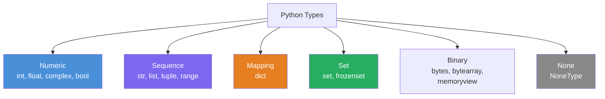

# Python Basics & Data Types — Interview Notes 🐍

## 1. Python's Key Characteristics

| Feature | Detail |
| :--- | :--- |
| **Interpreted** | Executed line-by-line; no separate compile step |
| **Dynamically typed** | Variable type is determined at runtime |
| **Strongly typed** | No implicit type coercion (`"1" + 1` → `TypeError`) |
| **Garbage collected** | Reference counting + cyclic GC; memory managed automatically |
| **Everything is an object** | Even `int`, `bool`, `None` are first-class objects |
| **Multi-paradigm** | OOP, functional, procedural — all supported |

---

## 2. Variables & Naming

```python
x = 10          # int
name = "Alice"  # str
_private = 42   # convention: module-private
__mangled = 1   # name-mangled inside a class
MY_CONST = 3.14 # convention: constant (not enforced)

# Multiple assignment
a, b, c = 1, 2, 3
x = y = z = 0   # all point to the same object
a, *rest = [1, 2, 3, 4]  # a=1, rest=[2,3,4]
```

> [!NOTE]
> Variables are **labels pointing to objects**, not memory boxes. Assignment changes which object the label points to.

---

## 3. Built-in Data Types Overview



---

## 4. Numeric Types

```python
# int — arbitrary precision
x = 10_000_000  # underscores for readability
big = 2 ** 100  # no overflow!

# float — IEEE 754 double precision
f = 3.14
0.1 + 0.2 == 0.3   # False! floating-point imprecision
import decimal
from decimal import Decimal
Decimal("0.1") + Decimal("0.2") == Decimal("0.3")  # True

# complex
c = 3 + 4j
c.real   # 3.0
c.imag   # 4.0
abs(c)   # 5.0 (magnitude)

# bool is a subclass of int
isinstance(True, int)  # True
True + True            # 2
```

> [!IMPORTANT]
> `bool` is a subclass of `int`. `True == 1` and `False == 0`. This trips up interviewers!

---

## 5. String (`str`)

Immutable, Unicode by default.

```python
s = "Hello"
s[0]           # 'H'
s[-1]          # 'o'
s[1:4]         # 'ell'  (slicing: start:stop:step)
s[::-1]        # 'olleH' (reverse)

# f-strings (Python 3.6+) — ALWAYS prefer these
name = "Alice"
f"Hello, {name!r}"          # Hello, 'Alice'
f"{3.14159:.2f}"            # '3.14'
f"{10_000:,}"               # '10,000'

# Common methods
"  hello  ".strip()          # 'hello'
"hello".upper()              # 'HELLO'
"Hello World".split()        # ['Hello', 'World']
"-".join(["a","b","c"])      # 'a-b-c'
"hello".startswith("he")     # True
"hello".replace("l", "r")   # 'herro'
"abc".find("b")              # 1  (-1 if not found)
"abc".index("b")             # 1  (ValueError if not found)

# Multiline
text = """Line 1
Line 2"""

# Raw strings — no escape processing
path = r"C:\Users\name"
```

> [!TIP]
> Use `"".join(list)` for string concatenation in a loop — it's O(n) vs O(n²) for `+=` in a loop.

---

## 6. List

Mutable, ordered, allows duplicates.

```python
lst = [1, 2, 3, "four", 5.0]
lst[0]          # 1
lst[-1]         # 5.0
lst[1:3]        # [2, 3]

# Mutation
lst.append(6)           # add to end: O(1) amortized
lst.insert(0, 0)        # insert at index: O(n)
lst.extend([7, 8])      # add multiple
lst.pop()               # remove & return last: O(1)
lst.pop(0)              # remove & return at index: O(n)
lst.remove(3)           # remove first occurrence of value
lst.sort()              # in-place sort (stable)
lst.reverse()           # in-place reverse

# Comprehension
squares = [x**2 for x in range(10) if x % 2 == 0]

# Unpacking
first, *middle, last = [1, 2, 3, 4, 5]
```

| Operation | Time Complexity |
| :--- | :--- |
| `lst[i]` | O(1) |
| `lst.append(x)` | O(1) amortized |
| `lst.insert(i, x)` | O(n) |
| `lst.pop()` | O(1) |
| `lst.pop(i)` | O(n) |
| `x in lst` | O(n) |
| `lst.sort()` | O(n log n) |

---

## 7. Tuple

Immutable, ordered, allows duplicates.

```python
t = (1, 2, 3)
t[0]           # 1
t[1:]          # (2, 3)
# t[0] = 10   # TypeError — immutable!

# Single-element tuple needs trailing comma
single = (42,)  # NOT (42)

# Named tuples — lightweight structured data
from collections import namedtuple
Point = namedtuple("Point", ["x", "y"])
p = Point(1, 2)
p.x  # 1

# Tuple unpacking
x, y, z = (10, 20, 30)
```

> [!NOTE]
> Tuples are hashable (when all elements are hashable) → can be used as dict keys or set members. Lists cannot.

---

## 8. Dictionary (`dict`)

Mutable, ordered (Python 3.7+), key-value pairs.

```python
d = {"name": "Alice", "age": 30}
d["name"]              # 'Alice'
d["city"] = "NY"       # add/update
del d["age"]           # delete key
d.get("missing", 0)    # safe lookup with default

# Iteration
for k, v in d.items():   print(k, v)
for k in d.keys():       print(k)
for v in d.values():     print(v)

# Methods
d.update({"age": 31, "job": "dev"})
d.pop("job", None)          # remove key, default if missing
d.setdefault("score", 0)    # set only if key missing

# Comprehension
sq = {x: x**2 for x in range(5)}

# Merging (Python 3.9+)
merged = d1 | d2            # new dict
d1 |= d2                    # in-place update
```

| Operation | Time Complexity |
| :--- | :--- |
| `d[k]` | O(1) average |
| `d[k] = v` | O(1) average |
| `del d[k]` | O(1) average |
| `k in d` | O(1) average |

---

## 9. Set & Frozenset

Mutable, unordered, no duplicates.

```python
s = {1, 2, 3, 2}    # {1, 2, 3}  — duplicates removed
s.add(4)
s.discard(99)       # no error if missing
s.remove(1)         # KeyError if missing

# Set operations
a = {1, 2, 3}
b = {2, 3, 4}
a | b    # union        {1, 2, 3, 4}
a & b    # intersection {2, 3}
a - b    # difference   {1}
a ^ b    # symmetric diff {1, 4}
a <= b   # subset check

# Frozenset — immutable, hashable
fs = frozenset([1, 2, 3])   # can be used as dict key

# Comprehension
even_set = {x for x in range(10) if x % 2 == 0}
```

> [!TIP]
> Use a `set` for O(1) membership tests. For a list: `x in list` is O(n). For a set: `x in set` is O(1).

---

## 10. Type Conversion

```python
int("42")         # 42
int(3.9)          # 3  (truncates, not rounds)
float("3.14")     # 3.14
str(100)          # '100'
bool(0)           # False
bool("")          # False
bool([])          # False — all empty containers are falsy
bool("false")     # True  — non-empty string!

list((1,2,3))     # [1, 2, 3]
tuple([1,2,3])    # (1, 2, 3)
set([1,1,2,3])    # {1, 2, 3}
dict([("a",1)])   # {'a': 1}
```

**Falsy values**: `False`, `0`, `0.0`, `""`, `[]`, `()`, `{}`, `set()`, `None`
**Truthy**: everything else

---

## 11. `is` vs `==`

```python
a = [1, 2, 3]
b = [1, 2, 3]
a == b   # True  — same VALUE
a is b   # False — different OBJECTS

x = None
x is None    # ✅ correct way to check None
x == None    # ✅ works but not idiomatic
```

> [!WARNING]
> CPython caches small integers (`-5` to `256`) and interned strings, so `x is y` may be `True` for small ints even without explicit assignment to same object. Never rely on `is` for value equality.

---

## 12. `None` Type

```python
def greet(name=None):
    if name is None:
        name = "World"
    return f"Hello, {name}"

# None is the implicit return of any function without a return statement
def do_nothing():
    pass
print(do_nothing())  # None
```

---

## 13. Summary Cheatsheet

| Type | Mutable | Ordered | Unique | Hashable |
| :--- | :---: | :---: | :---: | :---: |
| `int`, `float` | ❌ | — | — | ✅ |
| `str` | ❌ | ✅ | ❌ | ✅ |
| `list` | ✅ | ✅ | ❌ | ❌ |
| `tuple` | ❌ | ✅ | ❌ | ✅ (if elements hashable) |
| `dict` | ✅ | ✅ (3.7+) | keys unique | ❌ |
| `set` | ✅ | ❌ | ✅ | ❌ |
| `frozenset` | ❌ | ❌ | ✅ | ✅ |

> [!IMPORTANT]
> **Key Interview Points**:
> 1. `bool` is a subclass of `int` — `True == 1`, `False == 0`
> 2. Strings are immutable — use `"".join()` for repeated concatenation
> 3. Dicts preserve insertion order since Python 3.7+
> 4. `is` checks identity (same object); `==` checks equality (same value)
> 5. Empty containers (`[]`, `{}`, `""`) are falsy
> 6. Tuples of hashable elements are hashable; lists are never hashable
