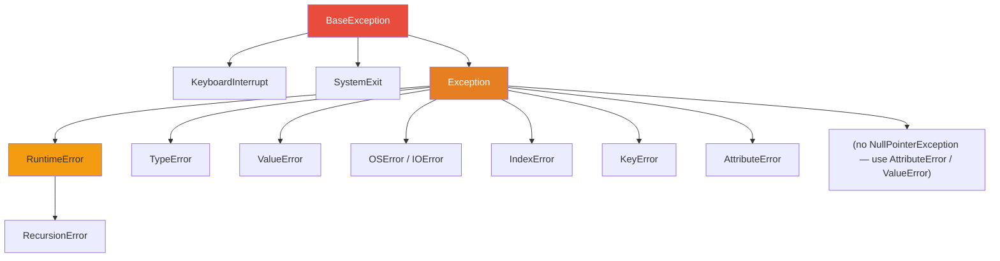

# Python Exception Handling & Context Managers — Interview Notes 🐍

## 1. Exception Hierarchy



---

## 2. try / except / else / finally

```python
try:
    result = 10 / 0
except ZeroDivisionError as e:
    print(f"Caught: {e}")
except (TypeError, ValueError) as e:   # multi-exception
    print(f"Type or value error: {e}")
except Exception as e:                 # generic fallback
    print(f"Unexpected: {e}")
    raise                              # re-raise — preserve traceback
else:
    print("No exception occurred")    # runs only if NO exception was raised
finally:
    print("Always runs")              # runs always — even after return/raise
```

> [!IMPORTANT]
> **`else` clause**: Runs only if the `try` block completed without raising. Distinguishes "code that might fail" (try) from "code that should run on success" (else) — cleaner than putting it in try.

> [!WARNING]
> `finally` runs even after a `return` statement. If `finally` also has a `return`, it **overrides** the try/except return value.

---

## 3. Raising Exceptions

```python
# Raise built-in
def divide(a, b):
    if b == 0:
        raise ValueError("Divisor cannot be zero")
    return a / b

# Raise from (chain exception — preserves cause)
try:
    int("abc")
except ValueError as e:
    raise RuntimeError("Failed to parse config") from e
    # traceback shows both exceptions

# Suppress chaining (Python 3)
raise RuntimeError("new error") from None   # hides original
```

---

## 4. Custom Exceptions

```python
# Base domain exception
class AppError(Exception):
    """Base class for application errors."""
    def __init__(self, message, code=None):
        super().__init__(message)
        self.code = code

    def __str__(self):
        if self.code:
            return f"[{self.code}] {super().__str__()}"
        return super().__str__()


# Specific errors
class NotFoundError(AppError):
    def __init__(self, resource, id):
        super().__init__(f"{resource} with id={id} not found", code=404)

class ValidationError(AppError):
    def __init__(self, field, message):
        super().__init__(f"{field}: {message}", code=422)
        self.field = field


# Usage
try:
    raise NotFoundError("User", 42)
except AppError as e:
    print(e)          # [404] User with id=42 not found
    print(e.code)     # 404
```

> [!TIP]
> Always define a **base exception class** for your application/library. Callers can catch the base to catch all domain errors, or specific subclasses for fine-grained handling.

---

## 5. Exception Chaining

```python
# Implicit chaining — Python auto-sets __context__
try:
    open("missing.txt")
except FileNotFoundError:
    raise RuntimeError("Config load failed")
# Traceback shows both: "During handling of the above exception..."

# Explicit chaining — sets __cause__ (preferred)
try:
    open("missing.txt")
except FileNotFoundError as e:
    raise RuntimeError("Config load failed") from e
# Traceback: "The above exception was the direct cause of..."

# Inspect cause
try:
    ...
except RuntimeError as e:
    print(e.__cause__)     # directly cause (from X)
    print(e.__context__)   # implicit context
```

---

## 6. Common Built-in Exceptions Reference

| Exception | Cause | Example |
| :--- | :--- | :--- |
| `ValueError` | Right type, wrong value | `int("abc")` |
| `TypeError` | Wrong type entirely | `"a" + 1` |
| `KeyError` | Dict key not found | `d["missing"]` |
| `IndexError` | Sequence index out of range | `lst[99]` |
| `AttributeError` | Object has no attribute | `None.upper()` |
| `NameError` | Variable not defined | `print(undefined)` |
| `ZeroDivisionError` | Division by zero | `1/0` |
| `FileNotFoundError` | File doesn't exist | `open("x.txt")` |
| `PermissionError` | No access rights | `open("/etc/shadow")` |
| `RecursionError` | Max recursion depth | infinite recursion |
| `StopIteration` | Iterator exhausted | `next(iter([]))` |
| `NotImplementedError` | Abstract method not overridden | |
| `OverflowError` | Float too large | `math.exp(1000)` |
| `MemoryError` | Out of memory | |
| `ImportError` | Module not found | `import nonexistent` |
| `AssertionError` | `assert False` | |

---

## 7. Context Managers (`with` statement)

Guarantees setup and teardown — even if an exception occurs.

```python
# Built-in usage
with open("file.txt", "r") as f:
    content = f.read()
# f.close() called automatically

# Multiple resources
with open("src.txt") as src, open("dst.txt", "w") as dst:
    dst.write(src.read())

# ExitStack — dynamic number of context managers
from contextlib import ExitStack
files = ["a.txt", "b.txt", "c.txt"]
with ExitStack() as stack:
    handles = [stack.enter_context(open(f)) for f in files]
```

---

## 8. Custom Context Manager — Class-Based

```python
class DatabaseConnection:
    def __init__(self, url):
        self.url = url
        self.conn = None

    def __enter__(self):
        print(f"Connecting to {self.url}")
        self.conn = {"connected": True}   # simulate connection
        return self.conn                   # bound to 'as' variable

    def __exit__(self, exc_type, exc_val, exc_tb):
        print("Closing connection")
        self.conn = None
        # Return True to SUPPRESS the exception; False/None to propagate
        if exc_type is ValueError:
            print(f"Suppressing ValueError: {exc_val}")
            return True   # suppressed!
        return False       # propagate all others

with DatabaseConnection("postgres://localhost/db") as conn:
    print(conn)
    # raise ValueError("oops")   # would be suppressed

# __exit__ args:
# exc_type — exception class (or None if no exception)
# exc_val  — exception instance
# exc_tb   — traceback object
```

---

## 9. Custom Context Manager — `@contextmanager`

Much simpler using a generator.

```python
from contextlib import contextmanager

@contextmanager
def managed_resource(name):
    print(f"Acquiring {name}")
    resource = {"name": name}
    try:
        yield resource          # everything after yield is teardown
    except Exception as e:
        print(f"Error during {name}: {e}")
        raise                   # re-raise — don't suppress unless intentional
    finally:
        print(f"Releasing {name}")

with managed_resource("DB") as r:
    print(f"Using {r['name']}")
# Output:
# Acquiring DB
# Using DB
# Releasing DB
```

```python
# Real-world: temporary directory
from contextlib import contextmanager
import os, tempfile, shutil

@contextmanager
def temp_directory():
    tmpdir = tempfile.mkdtemp()
    try:
        yield tmpdir
    finally:
        shutil.rmtree(tmpdir)

with temp_directory() as d:
    # work with d — deleted on exit
    open(os.path.join(d, "test.txt"), "w").close()
```

---

## 10. `contextlib` Utilities

```python
from contextlib import (
    contextmanager,
    suppress,
    redirect_stdout,
    nullcontext,
    ExitStack,
)

# suppress — silently ignore specific exceptions
with suppress(FileNotFoundError):
    os.remove("maybe_missing.txt")
# No crash if file doesn't exist

# redirect_stdout — capture print output
import io
f = io.StringIO()
with redirect_stdout(f):
    print("captured")
output = f.getvalue()   # "captured\n"

# nullcontext — placeholder context manager (useful in conditional logic)
def process(data, file=None):
    cm = open(file, "w") if file else nullcontext()
    with cm as f:
        ...   # works whether file is provided or not
```

---

## 11. Best Practices

| Practice | Rule |
| :--- | :--- |
| ✅ Catch specific exceptions | `except ValueError` not bare `except:` |
| ✅ Never swallow silently | `except: pass` hides bugs |
| ✅ Use `raise` not `raise e` | `raise` preserves full traceback |
| ✅ Use `raise X from Y` | Chains exceptions explicitly |
| ✅ Use `with` for resources | Files, locks, DB connections |
| ✅ Return `False` from `__exit__` | Unless you explicitly want to suppress |
| ✅ Custom base exception | One per module/library |
| ✅ `else` for success path | Cleaner than putting in `try` |

---

## 12. Summary

> [!IMPORTANT]
> **Key Interview Points**:
> 1. `else` in try/except runs only if NO exception was raised — good for "success" code.
> 2. `finally` always runs — even after `return`; a `return` in `finally` overrides try/except return.
> 3. `raise` (bare) re-raises the current exception, preserving traceback; `raise e` resets traceback to current line.
> 4. `__exit__` returning `True` **suppresses** the exception; `False`/`None` propagates it.
> 5. `raise X from Y` → `__cause__` set; `raise X from None` → suppresses display of original exception.
> 6. `@contextmanager` uses a generator: code before `yield` = setup; after `yield` = teardown.
