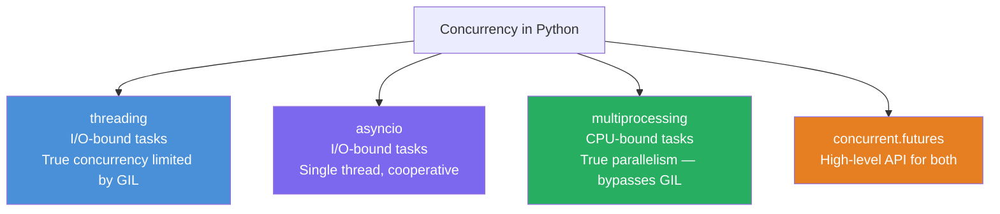

# Python Concurrency & Parallelism — Interview Notes 🐍

## 1. The Big Picture



| Problem | Best Tool |
| :--- | :--- |
| I/O-bound (network, file, DB) | `asyncio` or `threading` |
| CPU-bound (computation) | `multiprocessing` |
| Mix or simple use case | `concurrent.futures` |

---

## 2. The GIL (Global Interpreter Lock)

> [!IMPORTANT]
> The **GIL** is a mutex in CPython that allows only **one thread to execute Python bytecode at a time**.
>
> - `threading` module → **threads exist but only ONE runs Python at a time** (GIL)
> - `multiprocessing` → **separate processes, each with their own GIL** → true parallelism
> - For I/O-bound tasks threading still helps: threads release the GIL while waiting on I/O
> - Python 3.13+ introduces an opt-in **free-threaded** build (no GIL) — experimental

---

## 3. `threading` Module

```python
import threading
import time

def worker(name, delay):
    print(f"{name}: started")
    time.sleep(delay)
    print(f"{name}: done")

# Create threads
t1 = threading.Thread(target=worker, args=("T1", 2))
t2 = threading.Thread(target=worker, args=("T2", 1))
t3 = threading.Thread(target=worker, args=("T3", 3), daemon=True)

t1.start()
t2.start()
t3.start()   # daemon: dies with main thread

t1.join()    # wait for t1 to finish
t2.join()    # wait for t2 to finish
# t3 is daemon — not joined, killed when main exits
```

### Thread Safety — Lock

```python
import threading

counter = 0
lock = threading.Lock()

def increment(n):
    global counter
    for _ in range(n):
        with lock:           # acquire/release automatically
            counter += 1    # critical section

threads = [threading.Thread(target=increment, args=(10000,)) for _ in range(5)]
for t in threads: t.start()
for t in threads: t.join()
print(counter)   # 50000 — correct with lock; without lock: data race!
```

### Other Synchronization Primitives

```python
# RLock — reentrant lock (same thread can acquire multiple times)
rlock = threading.RLock()

# Event — signal between threads
event = threading.Event()
event.set()          # signal
event.wait()         # block until set
event.clear()        # reset

# Semaphore — limit concurrent access
sem = threading.Semaphore(3)   # max 3 threads at once
with sem:
    access_limited_resource()

# Condition — wait for a condition
cond = threading.Condition()
with cond:
    cond.wait()       # release lock and wait
    cond.notify_all() # wake all waiters

# Barrier — sync N threads at a point
barrier = threading.Barrier(3)
barrier.wait()   # all 3 threads must reach here before any proceeds
```

### Thread-Local Storage

```python
local_data = threading.local()

def worker():
    local_data.x = threading.current_thread().name   # each thread has its own x
    print(local_data.x)

threading.Thread(target=worker).start()  # safe — no sharing
```

---

## 4. Producer-Consumer with `queue.Queue`

Thread-safe FIFO queue — the standard way to communicate between threads.

```python
import threading
import queue

q = queue.Queue(maxsize=10)   # maxsize=0 means unbounded

def producer():
    for i in range(5):
        q.put(i)              # blocks if full
        print(f"Produced {i}")
    q.put(None)               # sentinel to signal done

def consumer():
    while True:
        item = q.get()        # blocks if empty
        if item is None:
            break
        print(f"Consumed {item}")
        q.task_done()         # signal task complete

t1 = threading.Thread(target=producer)
t2 = threading.Thread(target=consumer)
t1.start(); t2.start()
t1.join(); t2.join()
```

---

## 5. `asyncio` — Async/Await

Single-threaded, event-loop-based concurrency. Perfect for I/O-bound tasks.

```python
import asyncio

async def fetch_data(url):
    print(f"Fetching {url}...")
    await asyncio.sleep(1)        # non-blocking sleep (simulates I/O)
    return f"Data from {url}"

async def main():
    # Sequential — runs one by one
    r1 = await fetch_data("url1")
    r2 = await fetch_data("url2")

    # Concurrent — runs all at once, waits for all to finish
    results = await asyncio.gather(
        fetch_data("url1"),
        fetch_data("url2"),
        fetch_data("url3"),
    )
    print(results)

asyncio.run(main())   # entry point — creates event loop
```

### Core Concepts

```python
# Coroutine — defined with async def, returns a coroutine object
async def my_coro(): ...

# Task — scheduled coroutine (wrapped by asyncio.create_task)
async def main():
    task = asyncio.create_task(my_coro())  # starts immediately!
    await task

# gather — run multiple coroutines concurrently
results = await asyncio.gather(coro1(), coro2(), coro3())

# wait — more control; can handle partial failures
done, pending = await asyncio.wait(
    {asyncio.create_task(c) for c in coros},
    timeout=5.0
)

# as_completed — process results as they finish
async for task in asyncio.as_completed(coros):
    result = await task

# Timeout
async with asyncio.timeout(5.0):   # Python 3.11+
    await slow_operation()

try:
    await asyncio.wait_for(slow_operation(), timeout=5.0)
except asyncio.TimeoutError:
    print("Timed out")
```

### Async Context Managers & Iterators

```python
class AsyncDB:
    async def __aenter__(self):
        await asyncio.sleep(0.1)  # simulate async connect
        return self

    async def __aexit__(self, *args):
        await asyncio.sleep(0.1)  # simulate async close

async def main():
    async with AsyncDB() as db:
        ...

# Async generator
async def async_range(n):
    for i in range(n):
        await asyncio.sleep(0)   # yield control to event loop
        yield i

async def main():
    async for val in async_range(5):
        print(val)
```

> [!WARNING]
> **Never call blocking I/O** (`time.sleep`, `requests.get`, file reads) inside `async def` — it blocks the **entire event loop**. Use `await asyncio.sleep()`, `aiohttp`, `aiofiles`, or `asyncio.to_thread()` for blocking operations.

```python
# Run blocking code without blocking the event loop
result = await asyncio.to_thread(blocking_function, arg1, arg2)
```

---

## 6. `concurrent.futures` — High-Level API

Abstracts threading and multiprocessing behind a common interface.

```python
from concurrent.futures import ThreadPoolExecutor, ProcessPoolExecutor, as_completed

urls = ["url1", "url2", "url3", "url4"]

# ThreadPoolExecutor — I/O-bound
with ThreadPoolExecutor(max_workers=4) as executor:
    # map — simple: submit all, get results in ORDER
    results = list(executor.map(fetch, urls))

    # submit — fine-grained: returns Future objects
    futures = {executor.submit(fetch, url): url for url in urls}
    for future in as_completed(futures):
        url = futures[future]
        try:
            data = future.result()
            print(f"{url}: {data}")
        except Exception as e:
            print(f"{url} failed: {e}")

# ProcessPoolExecutor — CPU-bound
def cpu_work(n):
    return sum(i**2 for i in range(n))

with ProcessPoolExecutor() as executor:
    results = list(executor.map(cpu_work, [10**5, 10**6, 10**7]))
```

### Futures

```python
future = executor.submit(func, arg)

future.done()      # True if completed
future.running()   # True if currently running
future.result(timeout=5)     # blocks until done, raises exception if one occurred
future.exception()           # returns exception or None
future.cancel()              # cancel if not started yet
future.add_done_callback(fn) # called when done
```

---

## 7. `multiprocessing` Module

```python
from multiprocessing import Process, Pool, Queue, Manager

# Process
def worker(n):
    print(f"Worker: {n**2}")

p = Process(target=worker, args=(5,))
p.start()
p.join()

# Pool — map over processes
with Pool(processes=4) as pool:
    results = pool.map(cpu_work, [1,2,3,4,5])   # blocks
    # or async:
    async_result = pool.map_async(cpu_work, data)
    results = async_result.get(timeout=30)

# Shared state — Queue (process-safe)
q = Queue()
q.put("hello")
q.get()

# Manager — shared objects between processes
with Manager() as manager:
    shared_list = manager.list([1,2,3])
    shared_dict = manager.dict({"a":1})
```

---

## 8. Concurrency Patterns

```python
# Rate limiting with Semaphore (asyncio)
async def fetch_with_limit(url, sem):
    async with sem:
        return await fetch(url)

sem = asyncio.Semaphore(10)   # max 10 concurrent requests
await asyncio.gather(*[fetch_with_limit(url, sem) for url in urls])

# Thread-safe singleton
import threading
_instance = None
_lock = threading.Lock()

def get_instance():
    global _instance
    if _instance is None:
        with _lock:
            if _instance is None:   # double-checked locking
                _instance = SomeClass()
    return _instance
```

---

## 9. Summary Reference

| Feature | `threading` | `asyncio` | `multiprocessing` |
| :--- | :--- | :--- | :--- |
| Parallelism | GIL-limited | ❌ (1 thread) | ✅ (real) |
| Best for | I/O-bound | I/O-bound | CPU-bound |
| Overhead | Medium | Low | High (process fork) |
| Shared memory | ✅ (careful!) | ✅ (single thread) | ❌ (use Queue/Manager) |
| Syntax | Imperative | `async/await` | Imperative |

> [!IMPORTANT]
> **Key Interview Points**:
> 1. **GIL**: CPython allows only 1 thread to run Python bytecode at a time — threads help for I/O, not CPU.
> 2. **asyncio is single-threaded** — concurrency via cooperative multitasking (`await` yields control).
> 3. `asyncio.gather()` runs coroutines **concurrently** (not parallel); `await coro()` is sequential.
> 4. **Never use blocking I/O** inside `async def` — use `await asyncio.to_thread()` instead.
> 5. `queue.Queue` is thread-safe; `asyncio.Queue` is for coroutines.
> 6. `concurrent.futures` is the high-level, portable interface — prefer it over raw thread/process creation.
> 7. `ProcessPoolExecutor` requires picklable functions (lambdas and closures won't work).
